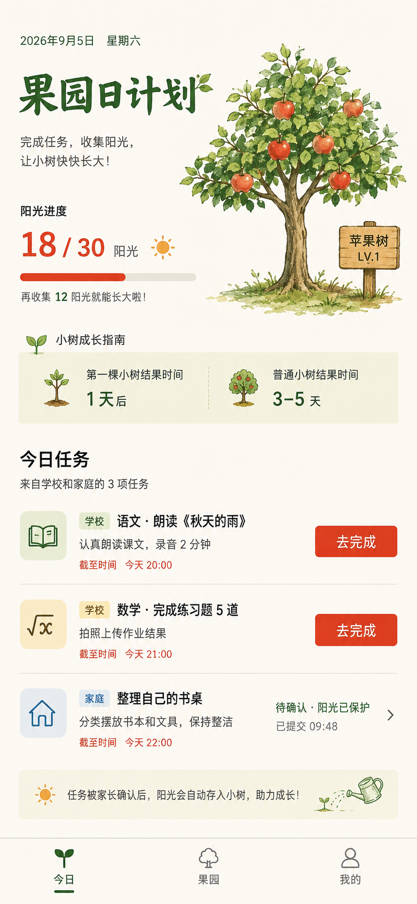

# 成长果园 UI 规范 v1.0

日期：2026-09-20。适用：孩子端、家长端、教师/助教端及机构管理界面。

用户已选择第二张「果园日计划」概念图作为视觉方向。本文件将该方向转换为后续页面统一使用的设计规则。颜色、字号和尺寸是为了开发一致性制定的规范值，并非对图片像素或字体的精确测量。产品品牌沿用仓库已确定的「律果」及品牌 Logo；「果园日计划」是页面标题，不作为正式产品名。

## 1. 唯一视觉基准与使用顺序

参考图用于判断风格、图文关系和视觉气质；业务逻辑以[平台总体设计](../superpowers/specs/2026-09-05-growth-orchard-platform-design.md)及后续已确认的业务规格为准。实现尺寸、组件状态和可访问性以本文为准。

后续 UI 开发先阅读本文。没有具体页面设计稿时，按本文组合既有组件；新页面不得自行引入另一套配色、字体或插画风格。参考图中日期、阳光数量、任务内容都是示例，必须由实际数据驱动。

## 2. 风格定义

**自然手绘果园 + 米白纸感 + 深绿标题 + 朱红操作 + 连续任务列表。**

- 页面像一本干净的自然观察手册，有温度，文字和操作清晰。
- 果树承担主要情感表达；导航、表单、列表保持克制。
- 大面积使用米白，深绿建立品牌识别，朱红强调主要操作和成长数字。
- 以留白、对齐、字重和细分割线组织内容，默认无阴影。
- 同一套视觉服务所有小学年级。高年级可以减少插画占比，但不更换品牌风格。

## 3. 色彩令牌

| 令牌 | 值 | 用途 |
| --- | --- | --- |
| `--orchard-bg` | `#FAF8F1` | 页面米白背景 |
| `--orchard-surface` | `#FFFDF7` | 弹层、表单等独立表面 |
| `--orchard-surface-soft` | `#F1EFDC` | 成长说明、温和提示 |
| `--orchard-brand` | `#28512B` | 深绿标题、选中导航、品牌图标 |
| `--orchard-primary` | `#C83D20` | 朱红主要按钮、关键成长数字 |
| `--orchard-primary-pressed` | `#A9321B` | 主要按钮按下 |
| `--orchard-on-primary` | `#FFFFFF` | 主要按钮文字 |
| `--orchard-text` | `#20251E` | 标题、正文 |
| `--orchard-text-secondary` | `#596052` | 次要说明、来源、时间 |
| `--orchard-divider` | `#DDD9CC` | 列表分隔线、进度轨道 |
| `--orchard-control-border` | `#858777` | 需要辨认的输入框/未选中控件边界 |
| `--orchard-success` | `#35603A` | 已完成、阳光已保护 |
| `--orchard-warning` | `#895C12` | 临近截止、需要补充 |
| `--orchard-danger` | `#AD302C` | 校验错误、危险操作 |
| `--orchard-disabled-bg` | `#E6E3D9` | 不可用按钮背景 |
| `--orchard-disabled-text` | `#737267` | 不可用按钮文字 |

朱红是品牌行动色，不表示任务失败；危险操作必须另有明确文字及危险图标。阳光图形可用金黄色，但金黄不用于小字正文。普通截止时间用次要文字色，只有临近截止或逾期才启用语义颜色。

学科图标底色可使用浅绿 `#E8ECD3`、浅麦黄 `#F7E8BE`、浅蓝 `#E6EDF1`，对应前景使用深绿、棕色 `#70531C`、蓝灰 `#355E76`。一旦建立科目映射就全端一致；颜色不替代“语文/数学/家庭”等文字标签。

v1 以浅色主题为基准。没有完整深色设计与检查前，不对插画和页面做简单反色。

## 4. 字体与文字层级

正文优先系统中文无衬线：`-apple-system, BlinkMacSystemFont, "PingFang SC", "Microsoft YaHei", sans-serif`。手写感只用于首页短标题或已制作的品牌字样；实际字体需单独确认授权，无法使用时回退系统字体，不阻塞页面显示。全产品最多两种字体。

| 层级 | 字号 / 行高 | 字重 | 用途 |
| --- | --- | --- | --- |
| 首页展示标题 | 30 / 38 px | 600 | 果园日计划，首页最多一处 |
| 页面标题 | 22 / 30 px | 600 | 任务详情、发布任务等 |
| 分区标题 | 20 / 28 px | 600 | 今日任务、待确认 |
| 任务标题 | 17 / 25 px | 600 | 列表主内容 |
| 正文/按钮 | 16 / 24 px | 400 / 500 | 操作、说明 |
| 辅助信息 | 14 / 21 px | 400 | 来源、截止时间 |
| 标签/导航 | 12 / 18 px | 500 | 短标签，避免长句 |
| 主要成长数字 | 32 / 38 px | 600 | 当前果树阳光，分母20px |

长说明优先删减文案或换行，不缩小文字。任务标题最多展示两行，详情页展示完整内容。增长数字使用等宽数字特性，防止更新时跳动。孩子端默认不使用小于12px的文字。

## 5. 尺寸、布局与适配

设计基准为390px宽移动屏，兼容320–430px。规范用逻辑px描述；小程序以750rpx画布实现时，390px设计值换算系数为750/390，而非始终乘2。字体、按钮触达范围和安全区需单独保证最小值。

- 间距体系：4、8、12、16、24、32、40px，禁止随页面随意增加新值。
- 页面水平边距20px，320px窄屏可降至16px。
- 同组元素间距8–12px；内容块间24px；大分区之间32px。
- 普通按钮/输入框圆角8px；插画图标底块12px；弹层顶部16px。
- 列表主体不包独立卡片；提示条允许浅底和8px圆角。
- 默认没有投影。仅需要与背景区分的浮层使用轻微投影。
- 交互触达区域至少44×44px，标准主按钮高48px。可见图标20–24px。
- 底部导航内容区高56px，另加设备安全区；正文底部预留对应空间。
- 微信胶囊与系统导航使用平台真实布局参数，图片不能包含假的状态栏和胶囊。

首页上部采用参考图的左文右树构图，建议240–300px高，树占上部宽度45%–52%。在普通屏首屏内可看到“今日任务”和至少一个可操作任务。窄屏左文右图放不下时改为上下排列；详情页和表单页不复用大幅果树头图。

## 6. 果树与插画

- 使用参考图的植物水彩/彩铅质感：自然分枝、柔和叶片、清晰果实、少量地面草木、温暖柔边。
- 果树是主视觉，其他装饰低密度。全屏纸纹可以非常轻，但不得影响阅读；正文区域接近纯色。
- 同一树种所有成长阶段保持视角、树干位置、光向、透明画布和根部锚点一致。
- 最少准备种子、嫩芽、幼树、开花、幼果、成熟六种状态。未成熟时不得展示整树成熟果实。
- 图片按显示尺寸至少2倍准备，优先透明PNG/WebP；保留树冠和根部，用等比例完整显示，禁止拉伸。
- 文字、数值、日期、按钮及进度条由真实组件渲染，不能烘焙进图片。
- 不用emoji、CSS拼树、混合风格的3D树替代正式果树资产。
- 页面操作图标采用同一套线性图标；自然插画只用于树、果实和少量成就，避免每个控件都绘本化。
- 图稿及字体在进入产品前记录来源和可用范围。参考图是风格基准，不能直接当整页背景截图发布。

## 7. 组件规范

### 7.1 任务列表行

一行按“学科图标—任务信息—状态/操作”排列，行间用1px分隔线，垂直内边距16px，高度由内容自然撑开。

- 左侧学科图标底块44–48px，内部图标22–24px。
- 中间依次显示来源/科目、任务标题、必要说明、截止时间。来源只作简短文字或小直角标签。
- 右侧按钮通常88–96px宽、高44px。窄屏或标题过长时放到信息区下方，不挤压正文。
- “去完成/继续完成/去订正”使用朱红主按钮。
- 待审核显示“待确认 · 阳光已保护”，用深绿状态文字，支持进入详情，不显示可再次完成的按钮。
- 已完成显示勾选图标与“已完成”；需要补充用琥珀文字加“去补充”；请假/取消状态采用中性色。
- 重复点击或审核重试不重复发放阳光；界面展示业务状态，不自行计算奖励。

### 7.2 按钮

主按钮：朱红实底、白字、8px圆角。次按钮：透明或米白底、深绿字和1px深绿边框。轻操作：深绿文字加必要箭头。破坏性操作使用明确动作名称，不与“去完成”混用。

状态包含默认、按下、加载、禁用。加载保持按钮宽度和文字可辨认；提交中禁止重复操作。一个决策区域只有一个主操作，独立任务行可以各有自己的操作。

### 7.3 成长进度

显示“18 / 30 阳光”“再收集12个阳光就能结果”，数字与文字口径一致。轨道高6–8px，朱红实色填充，不用闪烁和强渐变。数值以当前果树成长进度为准，不能把累计阳光写成今日阳光。

首棵树提示“完成今日任务，首棵果树当天可成熟”；普通树提示“通常3～5天成熟，取决于任务完成情况”。不显示固定倒计时，不承诺仅等待就能结果。成长指南只在首次使用或主动展开时详细显示，日常首页收起为简短入口。

### 7.4 提示、标签与导航

提示条：浅麦色或浅米色底、8px圆角、12–16px内边距，一枚小图标加1–2行短文。核心状态直接贴近任务，避免用多个全局提示重复说明。

孩子端导航为“今日 / 果园 / 我的”。选中项深绿图标、深绿文字和短下划线；未选中用次要文字色。家长端和教师端沿用图标尺寸、间距、选中态，按各自已确认的信息架构设置入口。

### 7.5 表单、照片与弹层

表单采用顶部标签、48px输入区、16px输入文字；必填与错误就地解释。错误时保留已填内容。复杂发布流程可以分步，但不引入新的装饰风格。

照片按原比例缩略展示，可放大、删除、重新上传；分别显示上传中、成功和失败。照片生成任务先进入可编辑草稿，确认后发布。审核证据图和果树插画有明确区域区分。

确认/选择使用原生风格底部弹层或对话框，米白实底、明确标题、主次按钮，遮罩不做玻璃模糊。详情使用正常页面，不把长任务说明塞进小弹窗。

### 7.6 空白、加载和失败

空白页使用一张小型同风格植物插画、一句原因和一个下一步按钮。加载只覆盖正在变化的内容区域；有旧内容时保留旧内容。失败说明能采取的动作，例如“照片上传失败，请重试”，不清空用户输入，不显示服务器代码给孩子。

## 8. 动效

- 控件按下/状态切换120–180ms，弹层200–240ms。
- 阳光入树约500–700ms；阶段成长约600–900ms；采摘约400–600ms，可跳过。
- 不循环摇树、闪光、跳数字，不强迫等待动画才能操作。
- 尊重减少动态效果的设置，低性能设备使用静态变化。
- 提交后先显示保护状态，实际入账事件触发阳光入树；刷新或重复进入不重播同一笔奖励。

## 9. 各角色的统一与区别

| 角色 | 保留的共同语言 | 页面重点 |
| --- | --- | --- |
| 孩子 | 米白、深绿、朱红、水彩果树、统一任务行 | 今日行动、成长反馈，首页有主插画 |
| 家长 | 相同色彩、字阶、表单、按钮、图标 | 孩子切换、待确认、全部来源任务；小幅成长摘要 |
| 教师/助教 | 相同令牌和列表交互 | 当前分组、发布、提交与审核；共育树适量展示 |
| 机构管理 | 同一品牌色和语义状态 | 分组、成员、任务与权限；用表格和筛选支持密集操作 |

业务数据可见范围不因视觉统一而改变。家长看自己孩子；机构页面不出现家庭愿望、其他机构任务或个人阳光总量。切换孩子或机构时上下文名称始终可见，避免审核错人。

## 10. 组件库与开发约定

组件库只提供交互基础；所有皮肤遵守本文。原生微信小程序可沿用此前调研的[TDesign MiniProgram](https://github.com/Tencent/tdesign-miniprogram)作为优先候选，[WeUI MiniProgram](https://github.com/wechat-miniprogram/weui-miniprogram)作为平台交互参考。具体依赖版本与兼容性在接入时核验；本次未安装或更换依赖。

- 全项目统一一套基础组件库，不混用多套默认按钮、弹窗和导航。
- 色值、字号、间距集中管理，页面通过语义令牌引用，不逐页手写新色。
- 封装统一的 `TaskRow`、`GrowthProgress`、`FruitTreeScene`、`StatusHint`、`PrimaryButton`、`PhotoEvidence`、`RoleNavigation`。
- 果树插画与交互控件分层。任务权限、奖励、阶段阈值留在业务层，UI只接收状态和事件。
- 表单错误、长文案、缺图、低网速状态与正常态使用同一套组件。
- 新 UI 工作以本文及参考图为输入；改品牌色、果树美术或导航语法时先更新规范，不做页面局部漂移。

## 11. 不采用的视觉做法

- 把每一行任务包进大圆角悬浮卡片，层层套卡片。
- 大面积渐变、玻璃拟态、重投影、荧光高饱和背景。
- 全屏巨型问候语、无意义指标卡、为填满页面添加模块。
- 正文用手写字体、每个标签都是胶囊、每个科目一个随机颜色。
- 任务页被大幅插画挤满，首屏看不到行动入口。
- 用真实照片、扁平卡通、写实3D、水彩树混搭同一套果园。
- 照搬图中的“1天后”、固定日期、示例奖励和成熟树形而忽略当前状态。

## 12. 页面验收清单

- [ ] 与第二张基准图保持米白、深绿、朱红及植物手绘气质。
- [ ] 色彩、字阶、圆角和间距全部来自本规范。
- [ ] 今日任务和首个操作在普通移动屏首屏可发现。
- [ ] 320px窄屏、长标题、大字体时无重叠、裁切或横向滚动。
- [ ] 所有按钮触达区域至少44px，底部内容不被导航遮挡。
- [ ] 普通正文对比度目标至少4.5:1，状态不只靠颜色表达；实际组合在实现后检查。
- [ ] 果树素材与成长阶段一致，数字和文案来自实际业务数据。
- [ ] 待审核、已完成、订正、请假、取消、上传失败均有明确状态。
- [ ] 没有重复奖励动画或重复提交入口，没有把等待审核表现为失败。
- [ ] 孩子、家长、教师端视觉一致，信息优先级及权限边界正确。

## 13. 可复用的 UI 开发说明

> 请先阅读 `docs/design/UI规范.md` 和 `docs/design/assets/orchard-day-plan-reference.png`，按已选“果园日计划”风格完成页面。使用米白纸感背景、深绿标题、朱红主操作、自然水彩果树和带细分割线的连续列表。沿用规范令牌、字阶、间距与状态，不自行增加渐变、悬浮卡片或新的插画风格。业务文字、阶段及权限以实际模型为准；提交页面时检查窄屏、长标题、待审核、失败和安全区。
